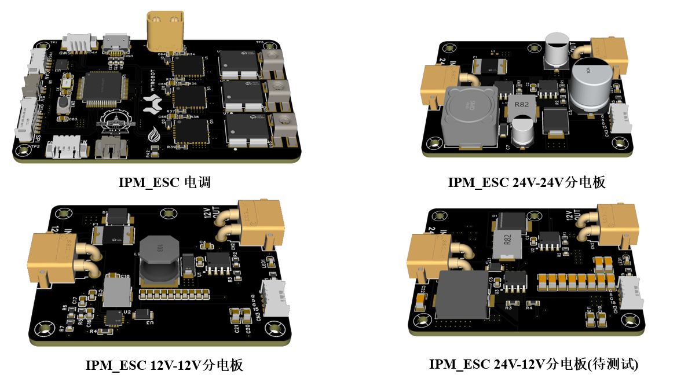
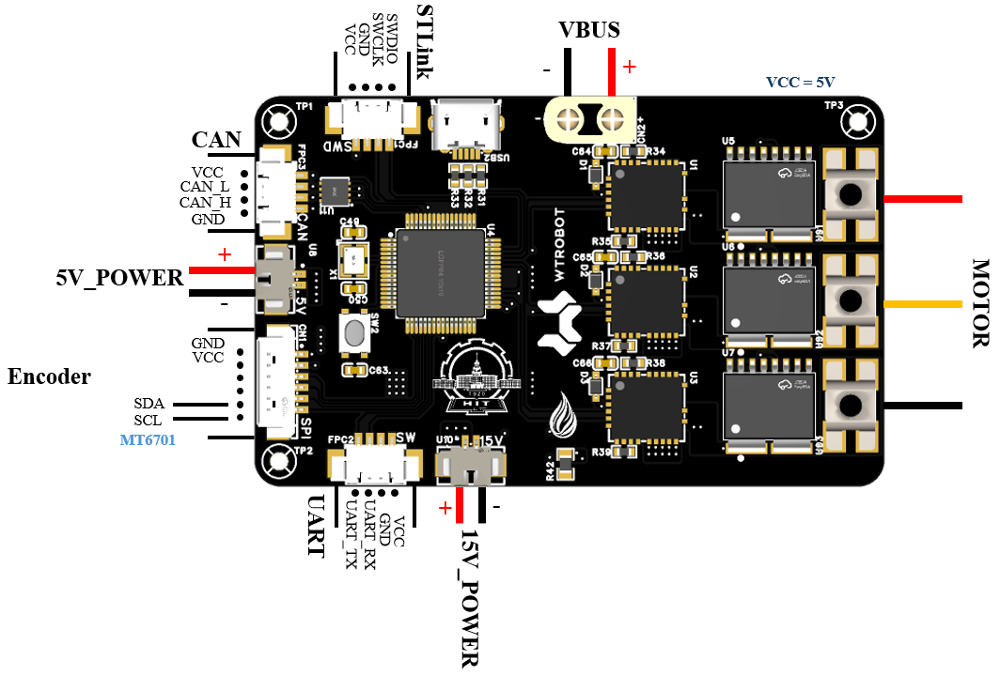
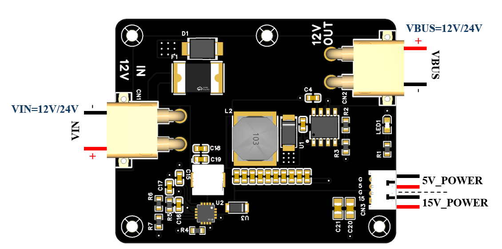
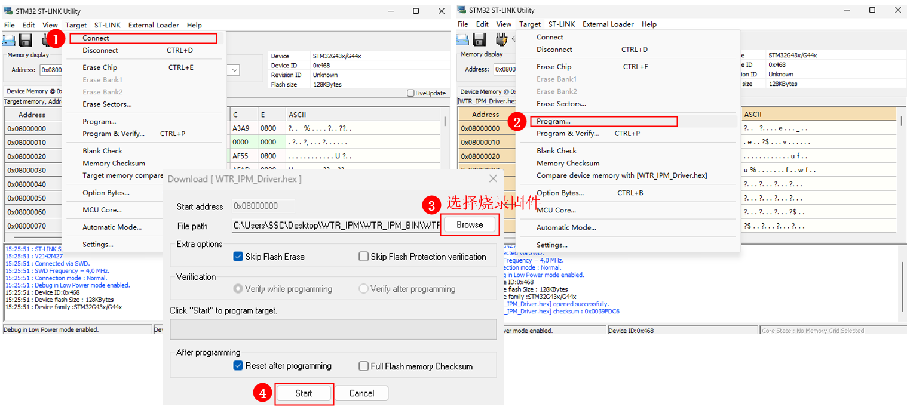

# WTR_IPM_ESC

哈尔滨工业大学(深圳) WTR 战队研发，中小功率 PMSM 电机驱动器。

> **硬件型号**
>
> - 主控：STM32G431RBT6
> - 驱动器：IRSM005-301MH
> - 电流采样：TMCS1123B2AQDVGR(霍尔传感器)

> **软件参数**
>
> - 编码器：MT6701/AS5600
> - 运行模式：有感 FOC(速度控制/位置控制)
> - 通信方式：CAN/UART
> - 校准：极对数/编码器安装方向/编码器机械零点偏移
> - 保护：过流保护
>
> - ***自动校准电流环/速度环参数，校准之后无需修改。***

> **硬件参数**
>
> - 最大相电流：**30A** (软件最大相电流限制：**8A**)；
> - 最大母线电压：**48V**；

## 硬件接线

IPM-ESC 包括两部分：**电调主体和适配分电板**。

>***IPM-ESC 接线图***
>
>**电调主体：**
>
>
>
>**电调分电板(12V-12V/24V-24V/24V-12V):**
>
>

使用时，***连接分电板和电调的 VBUS，5V_POWER 和 15V_POWER 接口。***

## 软件配置

固件位置：`WTR_IPM_BIN/WTR_IPM_Driver.hex`。

连接 STlink，使用 STM32 ST-LINK Utility 烧录即可：

## 串口调试

可以使用串口转接板连接串口进行电机测试。

串口调试命令集见 `WTR_IPM_HandBook/UART_Command.md`。

## CAN 通信

可以使用外接 CAN 通信或者使用 MCU 进行 CAN 通信进行电机运行控制。

CAN 通信详细内容见 `WTR_IPM_HandBook/CAN_Command.md`。

