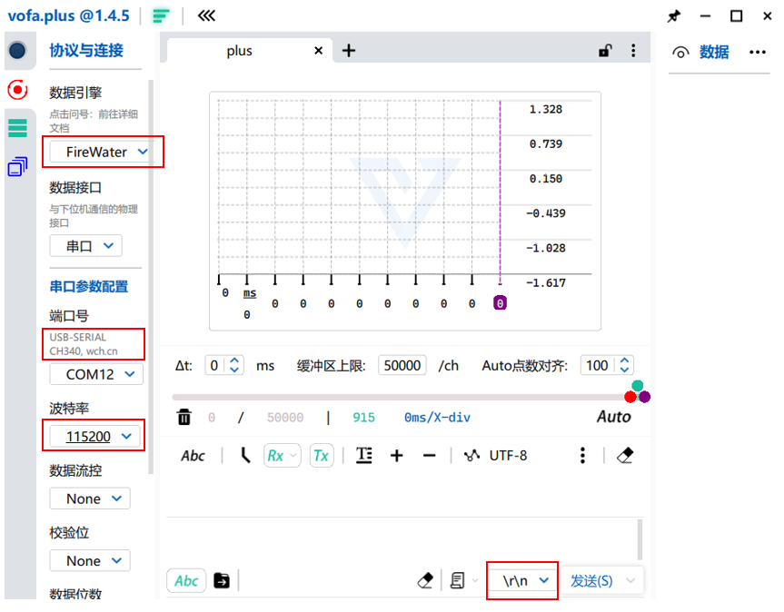

# WTR_IPM_ESC UART_Command

> **需要准备的材料**
>
> - Vofa+ 串口调试助手 (其余串口调试助手也可)；
>
>   通信为 TTL 电平，波特率 115200；
>
>   
>
> - CH340 串口转 USB 板 (任何 TTL-USB 均可)；

## 系统状态

> 电调包含以下状态：
>
> - **停止状态(STOP)；**
> - **调试运行状态(DEBUG_RUN)；**
> - **运行状态(RUN)；**
> - **校准状态(TEST)；**
> - **错误状态(FAULT)；**

## 串口指令集

### 读取指令 `get`

#### `get_none`

- 停止读取任何数据；

```shell
get_none
```

#### `get_speed`

- 读取速度数据，单位 rad/s；
- 速度数据将会连续传回并在 Vofa+ 上可打印波形；

```shell
get_speed
```

#### `get_position`

- 读取绝对位置(-inf - inf)，单位 rad；
- 位置数据将会连续传回并在 Vofa+ 上可打印波形；

```shell
get_position
```

#### `get_config`

- 读取配置：

  > **配置项：**
  >
  > - 电调 ID `id`；
  > - 母线电压设置值 `udc`；
  > - 位置环 PID 控制器参数 `position_pid kp ki kd outputmax`；
  > - 速度环 PI 控制器参数 `speed_pi kp ki outputmax`；
  > - 电流滤波器截止频率 `fc`；
  > - 电流环 PI 控制器参数 `id_pi kp ki` ，`iq_pi kp ki`；
  > - 编码器参数 `pole_pairs, encoder_direct, encoder_offset, encoder_type ` 。

- 配置数据将会单次传回。

```shell
get_config
```

### 配置指令 `config`

> ***该命令只在停止状态(STOP)下生效***

#### `config_position_pid [kp] [ki] [kd] [outputmax]`

- 参数含义：

  `kp`：位置环 PID 控制器的 Kp 值；

  `ki`：位置环 PID 控制器的 Ki 值；

  `kd`：位置环 PID 控制器的 Kd 值；

  `outputmax`：位置环 PID 控制器的最大输出值(最大速度)(>0)；

```shell
config_position_pid 20 20 0.2 400
```

#### `config_speed_pi [kp] [ki] [outputmax]`

- 参数含义：

  `kp`：速度环 PID 控制器的 Kp 值；

  `ki`：速度环 PID 控制器的 Ki 值；

  `outputmax`：速度环 PID 控制器的最大输出值(最大q轴电流)(>0)；

```shell
config_speed_pi 0.1 50 1
```

#### `config_current_pi [kp] [ki] `

- 参数含义：

  `kp`：电流环 PID 控制器的 Kp 值；

  `ki`：电流环 PID 控制器的 Ki 值；

```shell
config_current_pi 0.5 20
```

#### `config_idq_filter [fc]`

- 参数含义：

  `fc`：电流采样滤波器的截止频率(Hz)，用于滤除高频噪声；

```shell
config_idq_filter 100
```

#### `config_encoder [pole_pairs] [encoder_direct] [encoder_offset] [encoder_type]`

- 参数含义：

  `pole_pairs`：电机极对数；

  `encoder_direct`：电机编码器安装方向，和电角度正方向同向为1，反向为-1；

  `encoder_offset`：电机编码器安装偏移；

  `encoder_type`：电机编码器类型，比如`MT6701`；

```shell
config_encoder 7 1 0.0 MT6701
```

> ***建议使用该指令后通过 `calibration` 指令执行一次校准。***

#### `config_id [id]`

- 参数含义：

  `id`：设置电调 ID；

```shell
config_id 1
```

#### `config_udc [udc]`

- 参数含义：

  `udc`：母线电压值(V)，**根据分电板类型选取**；

```shell
config_udc 12.0
```

#### `save`

- 保存所有配置项到 FLASH 中；

> ***上电时默认加载上次保存的配置项。***
>
> ***建议在修改配置项结束之后运行一次`save`指令。***

### 校准指令 `calibration`

> ***该命令只在停止状态(STOP)下生效***

#### `calibration`

- 执行校准：
  1. **编码器极对数检测**：电机将缓慢旋转一圈；
  2. **编码器安装方向和偏移检测**：电机将会运动到3个点；
- 单项校准结束后，Vofa+ 将回传相关信息。
- **校准执行结束后将会修改编码器参数 `pole_pairs, encoder_direct, encoder_offset, encoder_type ` 。**
- ***该指令将会使得电调进入校准状态(TEST)，校准结束后电调自动进入停止状态(STOP)***；

```shell
calibration
```

> **建议校准时间：**
>
> - ***编码器重新安装后的初次上电；***
> - ***三相线线序改变后的初次上电；***

> ***校准完成后强烈建议运行一次`save`指令以保存校准得到的参数。***

### 运行指令 `set`

#### `set_position [position]`

- 参数含义：

  `position`：电机运行目标位置(-inf-inf)，单位rad；
  
- ***该指令将会使得电调进入调试运行状态(DEBUG_RUN)***；

```shell
set_position 100
```

> ***该位置为电机校准后的累积位置，如果上电后未运行过校准指令，该位置的零点将会是电机上电一刻的位置。***
>
> ***该命令在运行状态(RUN)/校准状态(TEST)/错误状态(FAULT)下无效。***

#### `set_speed [speed]`

- 参数含义：

  `speed`：电机运行目标速度，单位rad/s；

- ***该指令将会使得电调进入调试运行状态(DEBUG_RUN)***；

```shell
set_speed 100
```

> ***该命令在运行状态(RUN)/校准状态(TEST)/错误状态(FAULT)下无效。***

#### `stop`

- 电机进入停止状态(STOP)；

> ***该命令在运行状态(RUN)/校准状态(TEST)/错误状态(FAULT)下无效。***

### 清除错误指令

#### `clear_fault`

> ***该命令只在错误状态(FAULT)下生效***

- 电机进入停止状态(STOP)；

> ***请确保外部错误已经消除。***
